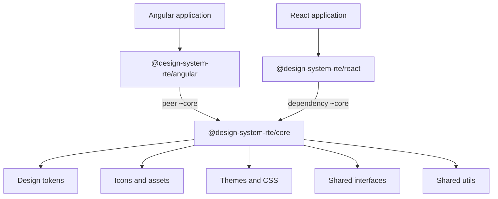

# Luciole

RTE France's design system — shared UI components, design tokens, and documentation for Angular and React applications.


## Supported frameworks

Officially supported and CI-validated versions. See [docs/COMPATIBILITY.md](docs/COMPATIBILITY.md) for the full matrix, including what npm peer ranges allow vs. what is actually supported.

| Runtime | Officially supported | npm install | Important |
|---------|---------------------|-------------|-----------|
| **Angular 19** | 19.2.x (`@latest`) | `npm install @design-system-rte/angular @design-system-rte/core` | Current line — CI-validated. |
| **Angular 18** | 18.2.x (legacy) | `npm install @design-system-rte/angular@angular18 @design-system-rte/core@1.11.0` | Use `@angular18` dist-tag, not `@latest`. |
| **Angular 17** | 17.3.x (legacy) | `npm install @design-system-rte/angular@angular17` | Use `@angular17` dist-tag. Core bundled on this line. |
| **React** | 18.x | `npm install @design-system-rte/react` | npm peer allows 19/20+, but only 18.x is CI-tested. |
| **Node.js** | 20 LTS | — | Matches CI. |

There is **no `angular19` npm dist-tag** — Angular 19 is `@latest`. See [docs/COMPATIBILITY.md](docs/COMPATIBILITY.md) for the full matrix.


## Documentation

Full component documentation, design guidelines, and setup guides live in Storybook:

**[opensource.rte-france.com/design-system-rte](https://opensource.rte-france.com/design-system-rte/)**

Get started guides (French):

- [Angular](https://opensource.rte-france.com/design-system-rte/?path=/docs/design-system-get-started---kit-de-d%C3%A9marrage-angular--docs)
- [React](https://opensource.rte-france.com/design-system-rte/?path=/docs/design-system-get-started---kit-de-d%C3%A9marrage-react--docs)


## Quick install

Choose the package that matches your stack:

**Angular application** — pick the npm dist-tag matching your Angular major version:

```bash
# Angular 19 (current line, @latest)
npm install @design-system-rte/angular @design-system-rte/core

# Angular 18 (legacy line)
npm install @design-system-rte/angular@angular18 @design-system-rte/core@1.11.0

# Angular 17 (legacy line — core bundled)
npm install @design-system-rte/angular@angular17
```

**React application** — core is included as a dependency:

```bash
npm install @design-system-rte/react
```

**Tokens, themes, or shared utilities only:**

```bash
npm install @design-system-rte/core
```


## Packages


| Package                      | Use when                                       | npm                                                             |
| ---------------------------- | ---------------------------------------------- | --------------------------------------------------------------- |
| `@design-system-rte/angular` | Building an Angular app                        | [npm](https://www.npmjs.com/package/@design-system-rte/angular) |
| `@design-system-rte/react`   | Building a React app (includes core)           | [npm](https://www.npmjs.com/package/@design-system-rte/react)   |
| `@design-system-rte/core`    | Design tokens, themes, icons, shared utilities | [npm](https://www.npmjs.com/package/@design-system-rte/core)    |


Angular, React, and Core use **independent version numbers** (for example angular `3.x`, react/core `1.x`). See [docs/COMPATIBILITY.md](docs/COMPATIBILITY.md) for version and dist-tag requirements.

## Architecture

Luciole is organized as a monorepo with a shared foundation and framework-specific component libraries:




- **Angular app** → `@design-system-rte/angular` + peer `@design-system-rte/core`
- **React app** → `@design-system-rte/react` (core pulled in automatically)


## Compatibility

| Runtime | Supported line | npm dist-tag |
|---------|---------------|--------------|
| Node.js | 20 LTS | — |
| Angular 19 | Current, CI-validated | `@latest` |
| Angular 18 | Legacy | `@angular18` |
| Angular 17 | Legacy | `@angular17` |
| React | 18.x CI-validated | `@latest` |

npm peer ranges alone are misleading — especially for Angular (`@latest` is 19.x only) and React (`>=18.0.0` has no upper bound). See [docs/COMPATIBILITY.md](docs/COMPATIBILITY.md).

## Getting started

1. **Install** the package for your framework (see [Quick install](#quick-install)).
2. **Configure theming** — add the theme mixin and `data-theme` / `data-mode` attributes on your root element. Details in the [React README](packages/react/README.md) or [Angular README](packages/angular/projects/ds-rte-lib/README.md), or in Storybook.
3. **Use components** — browse the [Storybook catalog](https://opensource.rte-france.com/design-system-rte/) for API docs and examples.


## Changelog and releases

- [CHANGELOG.md](CHANGELOG.md) — aggregated summary of recent changes
- [GitHub Releases](https://github.com/rte-france/design-system-rte/releases) — per-package release notes (`@design-system-rte/{package}@{version}`)
- Package changelogs: [core](packages/core/CHANGELOG.md), [react](packages/react/CHANGELOG.md), [angular](packages/angular/projects/ds-rte-lib/CHANGELOG.md)

Release and support policy: [SUPPORT.md](SUPPORT.md)