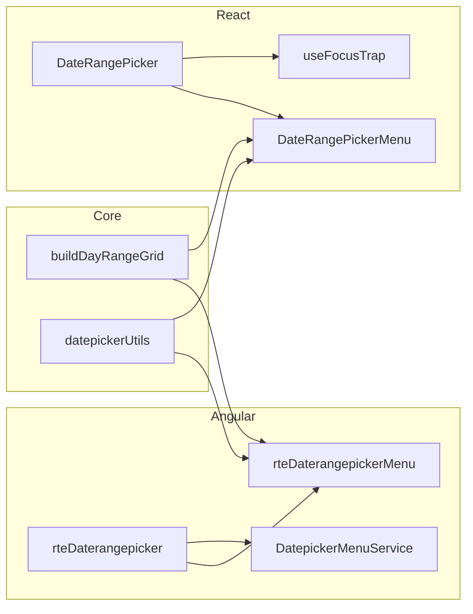

# DateRangePicker — Product Contract Compliance Report

**Verdict:** Both Angular and React implement the **core product intent** (two synchronized inputs, shared calendar, start→end selection cycle, range visualization, hover preview). Angular is closer to the contract overall; React is a functional port with **gaps in API surface, accessibility polish, and menu lifecycle**. Neither framework fully satisfies the accessibility matrix or several behavioral edge cases called out in review.

---

## Executive summary

| Area | Angular | React |
|------|---------|-------|
| Core layout & structure | Strong match | Strong match |
| Selection behaviors (cycle, reset, preview) | Strong match | Strong match |
| Visual range states | Strong match | Strong match |
| Options / API surface | Good, with unwired props | Incomplete |
| Accessibility | Partial | Partial, more gaps |
| Menu keyboard / focus | Strong (shared datepicker focus order) | Weaker (generic focus trap) |
| Review feedback (Jira) | Several open items | Focus trap flagged KO |

Shared logic lives in `packages/core/components/daterangepicker/` (`buildDayRangeGrid`, types). Both menus mirror the same SCSS/data-attribute range styling pattern.

---

## What is respected (both frameworks)

### Definition & layout

- **Two inputs + one shared calendar** — `rte-daterangepicker` (Angular) and `DateRangePicker` (React) render start/end fields side by side with an `arrow-double-right` separator.
- **Shared label and assistive text** — one label covers both fields; assistive text is hidden while the menu is open.
- **Menu under inputs** — dropdown positioned bottom with 8px offset.
- **Single month** — one month grid at a time, month-by-month navigation.
- **Fixed format** — Angular uses `applyDatepickerTextInputChange` (jj/mm/aaaa masking). React uses segmented digit input with the same intent.

### Core interactions (Behaviors)

| Contract behavior | Status |
|-------------------|--------|
| Cycle start → end → start on calendar picks | Implemented in both |
| End date before start → reset (clicked date becomes new start, cycle stays end) | Implemented in both |
| Single-day range (start = end) | Allowed |
| Hover preview during end cycle | `hoveredDate` + `data-in-preview` / `data-first-in-preview` / `data-last-in-preview` |
| `hasActions` / `hasAction` Cancel & Confirm footer | Present (Angular default `true`, React default `false`) |
| Without actions → auto-close on completed range | Implemented |
| External close / Escape → keep committed values | Both restore snapshot on dismiss |
| `minDate` / `maxDate` / `disabledDates` parametric | Passed to grid builders; disabled cells use `disabled` attribute |
| Opening from start icon → `activeCycle = start` | Implemented |

### Visual states

- **Range visualization** — `data-in-range`, `data-first-in-range`, `data-last-in-range` plus `.rte-date-rangepicker-link` connector bars (pill-shaped range band).
- **Selected / today / prev-next** — via `data-cell-type`.
- **Error, disabled, readOnly** — exposed as separate props (not unified `interactionState`).
- **Touch targets** — day cells are 40×40px (≥ 24×24 contract).
- **`prefers-reduced-motion`** — 120ms transitions disabled under reduced-motion in menu SCSS (both).

### Accessibility — partially respected

| Criterion | Angular | React |
|-----------|---------|-------|
| `role="group"` on inputs wrapper | Yes | Yes |
| Shared label via `aria-labelledby` | Yes | Yes |
| Per-input SR labels ("Date de début/fin") | Yes (visually hidden) | Yes (accent missing on "début") |
| Calendar icon labels | "Ouvrir le sélecteur de date de début/fin" | Same |
| Menu `role="dialog"` + `aria-modal` | Yes, label **"Choisir une période"** | Yes, label **"Choisir une date"** (mismatch) |
| Day grid `role="grid"` | Yes | Yes |
| Arrow-key calendar navigation | Yes | Yes |
| Focus return after close | Yes → triggering calendar button | No explicit focus return |
| Menu tab order (active cell → Annuler → Confirmer → nav) | Yes via `DatepickerMenuService` + `FocusTrapService` | Generic `useFocusTrap`; nav buttons remain natively tabbable |

### Out of scope — correctly delegated

- Business validation, error messages → application responsibility.
- `minDate` / `maxDate` / `disabledDates` → configurable but not enforced as product rules.
- No multi-range, no period comparison, no single-date mode.

---

## Likely deviations & risk areas

### 1. Accessibility gaps (contract matrix — both frameworks)

These are **missing in both** implementations:

- **Cycle announcements** — no `aria-live` for "Saisie de la date de début" / "Saisie de la date de fin" (WCAG 4.1.3).
- **`interactionState` unified model** — contract lists `enabled / hover / activeInput / activeMenu / error / disabled / readOnly`; implementations use decomposed props + CSS `data-*` instead.
- **Automated a11y test evidence** — contract table shows no tests; only Storybook interaction tests exist (`TabNavigation` tagged `skip-ci`).

### 2. Behavioral edge cases (from contract + Jira review)

| Issue | Contract expectation | Observed risk |
|-------|---------------------|---------------|
| **End icon without start date** | `activeCycle = start` | Both set `selectionMode = "end"` on end-icon open without checking if start exists (`openMenuForInput("end")` in Angular; `setSelectionMode("end")` in React). |
| **End icon when end already filled** | Open in end cycle to modify only end; if picked date < start → switch to start cycle | Jira notes this works only when end field is empty (`jj/mm/aaaa`). Logic looks correct when both dates are committed, but this path may still fail in edge cases (worth re-testing with filled end). |
| **Cancel button semantics** | End cycle: keep start, revert end, stay in end. Start cycle: **full reset**. | Both restore **committed snapshot at menu open** — equivalent for pending edits, but **not a full reset** if user was on start cycle with an existing committed range. |
| **Focus input start/end → active cycle** | Focus start → cycle start; focus end → cycle end (unless no start) | Angular: only calendar icons set `activeInput` / `selectionMode`; text focus does not. React: `activeInputRef` updates on focus, but `selectionMode` is not synced on text focus. |
| **Disabled/min-max date clicks close menu** | Menu should stay open; click does nothing | Cells are `disabled`; `onClickDay` returns early. If menu still closes, the bug is likely elsewhere (overlay handler). Worth verifying against Jira feedback. |
| **Persistent hover after click** | Jira flagged as unexpected | Likely conflation of **hover** vs **`data-datepicker-active`** (keyboard roving focus indicator). May be intentional per APG pattern. |

### 3. Angular-specific deviations

| Item | Detail |
|------|--------|
| `labelPosition` | Declared (`"top" \| "side"`) but **never used** in template |
| `fieldAriaLabel` | Declared, **not bound** to segmented fields |
| `isRequiredOptional` | Declared, unused in template |
| Padding (Jira) | Label/assistive vertical spacing may exceed single datepicker (2px label, 4px assistive expected) — `gap: $positive-spacing_0` on host but label has `padding: $positive-spacing_025` |
| `hasActions` + text input | Text commits **immediately**; `hasActions` only gates calendar pending flow |
| `hasActions` + emits during pending | Partial ranges emitted while menu is open (differs from single datepicker) |
| Naming | `hasActions` (Angular) vs `hasAction` (core/React) |

**Angular strengths vs React:** `ResizeObserver` for dropdown width, calendar type reset on close, focus return to triggering icon, custom menu tab order.

### 4. React-specific deviations

| Item | Detail |
|------|--------|
| `hasAction` default | `false` in component vs contract/Angular default `true` |
| Missing props | `hasLabel`, `labelPosition`, `locale`, `width`, `openedChange` |
| Field width | No fixed 176px per field (`fixedWidth={false}`) |
| Dialog label | `"Choisir une date"` instead of `"Choisir une période"` |
| Calendar type on close | **Not reset** — menu may reopen in month/year view |
| Focus trap | Jira: "focus trap KO"; uses generic `useFocusTrap` instead of `collectDatepickerMenuTabOrder` |
| Text validation | No start ≤ end enforcement on typed input; no shared masking pipeline |
| Shared `isFocused` | Both inputs show focused styling simultaneously |
| Hygiene | `console.log` left in `DateRangeInput` |
| Month/year `aria-current` | Missing on cells (present in Angular) |

---

## Options table compliance

| Contract property | Angular | React |
|-------------------|---------|-------|
| `hasLabel` | Yes | No (label always shown) |
| `labelText` | `labelText` | `label` |
| `isRequiredOptional` | Declared, unused | Via `showLabelRequirement` only |
| `hasAssistiveText` | Explicit boolean | Implicit (if `assistiveTextLabel` set) |
| `hasLocalActions` | `hasActions` (default `true`) | `hasAction` (default `false`) |
| `calendarType` day/month/year | Yes (parent-owned) | Yes (menu-internal) |
| `interactionState` | Not as single prop | Not as single prop |
| `startDateText` / `endDateText` | Driven by value | Driven by value |

---

## Cross-framework parity

Both frameworks share **range grid logic and visual styling**. Angular reuses the **datepicker focus-order infrastructure**; React does not yet consume `collectDatepickerMenuTabOrder`.

---

## Test coverage vs contract

The contract states **"No Tests were found testing the requirement."** In the repo:

- Storybook play tests: `WithAction`, `WithMinMax`, `DisabledDates`, `TabNavigation` (both; `skip-ci`).
- No dedicated `*.spec.ts` / unit tests for daterangepicker.
- No automated NVDA/contrast tests tied to the WCAG table.

---

## Recommended priority fixes (if aligning to contract)

### P0 — behavioral / a11y

1. End-icon open without start → force start cycle (both).
2. `aria-live` cycle announcements (both).
3. React: fix dialog label, focus trap / tab order, focus return on close.
4. Re-test end-icon behavior when end date is already filled (Jira).

### P1 — API parity

5. React: `hasLabel`, `locale`, `width`, `hasAction` default `true`.
6. Angular: wire `labelPosition`, `fieldAriaLabel`.
7. Align naming: `hasAction` vs `hasActions`.

### P2 — polish

8. Cancel semantics on start cycle (full reset vs snapshot restore).
9. Padding alignment with single datepicker (Jira).
10. React: reset `calendarType` on close; remove `console.log`.

---

## Bottom line

You **did respect the product contract on the essential UX**: dual inputs, shared calendar, sequential range selection, visual range band, hover preview, and local actions. The implementation is **production-shaped** especially on Angular.

The main deviations are **not in the happy path** but in **accessibility completeness** (cycle announcements, focus management), **edge-case behaviors** (end icon without start, cancel semantics, end-field-already-filled), **API surface parity** (React missing several options), and **review feedback** (padding, focus trap in React, disabled-date click behavior). Treat Angular as the nearer reference; React needs another pass before claiming full contract compliance.

---

## File references

### Angular

- `packages/angular/projects/ds-rte-lib/src/lib/components/daterangepicker/daterangepicker.component.ts`
- `packages/angular/projects/ds-rte-lib/src/lib/components/daterangepicker/daterangepicker.component.html`
- `packages/angular/projects/ds-rte-lib/src/lib/components/daterangepicker/daterangepicker-menu/daterangepicker-menu.component.ts`

### React

- `packages/react/src/components/pickers/daterangepicker/DateRangePicker.tsx`
- `packages/react/src/components/pickers/daterangepicker/dateRangePickerMenu/DateRangePickerMenu.tsx`

### Core

- `packages/core/components/daterangepicker/daterangepicker.interface.d.ts`
- `packages/core/components/daterangepicker/daterangepicker.utils.ts`
